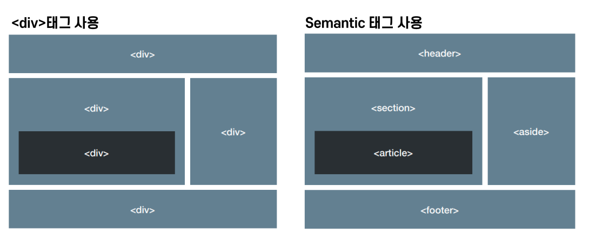

= NHN HTML

== HTML
* 웹 페이지가 어떻게 구조화 되어 있는지 브라우저가 알 수 있게 하는 마크업 언어

=== 평문
* 여는 태그(Opening tag)
** 요소의 이름과, 열고 닫는 꺽쇠 괄호로 구성, 태그 시작 부분부터 효과 적용

* 닫는 태그(Closing tag)
** 요소의 앞에 슬래시(/)가 있는 것을 제외하면 여는 태그와 같음. 요소를 종료

* 잘못된 사용
** tag open & close 순서를 맞춰서 사용
** 동자은 되지만 올바른 사용법은 아님
[source, html]
----

내 강아지는 <strong>포메라니안 입니다.
</strong>
----

=== 속성
[source, html]
----

내 강아지는 포메라니안 입니다.

----
* 요소에 실제로는 나타내고 싶지 않지만 추가적인 내용을 담고 싶을 때 사용
** 요소 이름 다음에 바로 오는 속성인 요소 이름과 속성 사이에 공백을 둠
** 하나 이상의 속성이 있는 경우 속성 사이에 공백
** 속성 이름 다음에는 등호(=)가 붙음
** 속성 값은 따옴표로 감싸야 함

=== 공백과 특수 문자
* html의 newline or blank
**  
[source, html]
----

This is my page

----
* 주석
[source, html]
----
<!--
나는 주석
 -->
----

=== Boolean 속성
[source,html]
----
<input type="text" disabled>
----

=== HTML 문서의 구조
* <head></head>
* <body></body>

=== DOCTYPE
* 브라우저가 문서를 해석하는 방법 정의

* HTML5
[source,html]
----
<!DOCTYPE html>
----

=== XHML 1.0
* Strict(엄격한 규칙)
[source,html]
----
<!DOCTYPE html PUBLIC "-//W3C//DTD XHTML 1.0 Strict//EN" "http://www.w3.org/TR/xhtml1/DTD/xhtml1-strict.dtd">
----
* Transitional(과도적인 규칙)
[source,html]
----
<!DOCTYPE html PUBLIC "-//W3C//DTD XHTML 1.0 Transitional//EN" "http://www.w3.org/TR/xhtml1/DTD/xhtml1-transitional.dtd">
----
* Frameset(프레임 사용 가능)
[source,html]
----
<!DOCTYPE html PUBLIC "-//W3C//DTD XHTML 1.0 Frameset//EN" "http://www.w3.org/TR/xhtml1/DTD/xhtml1-frameset.dtd">
----

=== XHTML 1.1
[source,html]
----
<!DOCTYPE html PUBLIC "-//W3C//DTD XHTML 1.1//EN"  "http://www.w3.org/TR/xhtml11/DTD/xhtml11.dtd">
----

=== HTML 4.01
* Strict(엄격한 규칙)
[source,html]
----
<!DOCTYPE HTML PUBLIC "-//W3C//DTD HTML 4.01//EN" "http://www.w3.org/TR/html4/strict.dtd">
----
* Transitional(과도적인 규칙)
[source,html]
----
<!DOCTYPE HTML PUBLIC "-//W3C//DTD HTML 4.01 Transitional//EN" "http://www.w3.org/TR/html4/loose.dtd">
----
* Frameset
[source,html]
----
<!DOCTYPE HTML PUBLIC "-//W3C//DTD HTML 4.01 Frameset//EN" "http://www.w3.org/TR/html4/frameset.dtd">
----

=== DOCTYPE을 생략
* 브라우저는 쿼크 모드(Quirks Mode)로 페이지를 렌더링 함
* 쿼크 모드에서는 이전 세대의 브라우저에 맞는 비표준적 방법의 CSS
* 쿼크 모드는 브라우저마다 렌더링 방식이 다름
* 결과적으로 크로스 브라우징 문제 발생
* 쿼크모드란?
** 2008년 웹표준 준수지침이 제정, 예전에 만들어진 비 표준 웹페이지들이 최신 버전의 브라우저에서 깨짐 현상을 방지하기 위해 하위 브라우저와 호환성을 유지하는데 사용되는 문서모드입니다.

=== 문서의 시작과 끝 - html 태그
[source, html]
----
<!DOCTYPE html>
<html lang="ko">
    <head>
        <meta charset="utf-8">
        <title>My test Page</title>
    </head>
    <body>
        <!-- body content -->
    </body>
</html>
----
* HTML 전체를 감싸는 태그

=== <head>
* <title>
** 제목의 표시
* 파일 링크와 스크립트
** <link rel="..."href="..."/>
** 파일 참조
* JavaScript
**  파일 참조

=== 페이지에 대한 메타 데이터 포함
* 인코딩 설정
[source, html]
----
<meta charset="UTF-8">
----
* IE 호환성
[source, html]
----
<meta http-equiv="X-UA-Compatible" content="IE=edge">
----
* 페이지 설명
[source, html]
----
<meta name="keywords" content="movie">
<meta name="description" content="Simple Movie Database">
<meta name="author" content="Randy">
----

=== charset이 잘못되면 생기는 일
[source, html]
----
<!DOCTYPE html>
<html lang="ko">
    <head>
        <meta charset="euc-kr" />
        <title>실습-02</title>
    </head>
    <body>
        <h1>euc-kr 한글 인코딩 테스트</h1>
    </body>

</html>
----
* 다음과 같을 때 깨짐 현상 발생

== HTML 문서를 표혀하는 모든 TAG는 두분류로 나뉨

=== InLine Tag

[source, html]
----
, <a>,  
,<button>,,<input>,<select>,<textarea>,<label>,<strong>
----

=== Block Tag
* 자신의 내용과 앞 뒤 태그의 내용을 다른 라인에 출력하는 태그
* 주로 구조를 만들 때 사용
* 대표적인 tag는 

* 다만 
 태그 내부에는 인라인 요소만 표현할 수 있습니다.
* 반드시 알아야 할 태그
[source, html]
----
<form>, <ul>, 
, <table>, 
,<address>
<h1>,<h2>, <h3>, <h4>, <h5>, <h6>
----

=== List
* 계층 구조의 표현
* 순서 없는 목록 : <ul>,<li>
[source, html]
----
<ul>
    <li>우유</li>
    <li>계란</li>
    <li>빵</li>
    <li>후무스(중동의 김치)</li>
    <li>베이컨</li>
</ul>
----

* 순서가 있는 목록 : <ol><li>
[source, html]
----
<ol>
    <li>Avater</li>
    <li>Avengers: Endgame</li>
    <li>Titanic</li>
    <li>Starwars : Force Awaken</li>
    <li>Avengers: Infinity War</li>
</ol>
----

=== 중요(Emphasis)와 강조(Strong importance)
* 중요한 글자를 강조하기 위해 글자를 두껍게 표현하거나 기울여서 표현
[source, html]
----

<em>스래시 메탈</em> 밴드로는 <strong>메칼리카</strong>가 있습니다.

----
* __스래시 메탈__ 밴드로는 **메칼리카**가 있습니다.

* <strong> 콘텐츠의 자체의 중요성을 강조할 때 사용
* <b> tag 콘텐츠의 중요성 보다는 텍스트 자체에 주의를 끌기 위해서 사용됨
* <blockquote> : 블록인용구 (특별한 모양을 제공하지 않음)
* <address> : 해당 문서의 연락 정보, 이탤릭체로 표현 됩니다.

* abbr (약어)
[source, html]
----

웹 문서의 구조를 만들때 <abbr title="Hypertext Markup Language">HTML</abbr>을 사용합니다

----
* HTML에 마우스를 올리면 Full Text가 노출

=== Code를 나타낼 떄
* <code> : 일반적인 컴퓨터 코드를 나타냄
* <pre> : 코드블럭을 유지하기 위해 사용
* <var> : 변수 이름을 특별하게 표시
** 프로그래밍 또는 수학적 표현에서 변수를 정의하는 데 사용

* <kbd> : 컴퓨터에서 입력된 키보드 입력을 표시
* <samp> : 컴퓨터 프로그램의 출력을 표시

=== 날짜 표시
[source, html]
----
<!-- Standard simple date -->

<time datetime="2016-01-20">20 January 2016</time> <!-- Just year and month -->

<time datetime="2016-01">January 2016</time>

<!-- Just month and day -->

<time datetime="01-20">20 January</time>

<!-- Just time, hours and minutes -->

<time datetime="19:30">19:30</time>

<!-- You can do seconds and milliseconds too! --> <time datetime="19:30:01.856">19:30:01.856</time> <!-- Date and time -->

<time datetime="2016-01-20T19:30">7.30pm, 20 January 2016</time>

<!-- Date and time with timezone offset-->

<time datetime="2016-01-20T19:30+01:00">7.30pm, 20 January 2016 is 8.30pm in France</time>

<!-- Calling out a specific week number-->

<time datetime="2016-W04">The fourth week of 2016</time>

----

=== Hyperlink
* <HTML 파일, 텍스트 파일, 이미지, 문서, 비디오와 오디오 파일 등 웹상에 존재할 수 있는 모든 것을 연결

==== a tag
* 문법
[source, html]
----
<a href="링크할 주소">텍스트 또는 이미지</a>
----

=== table(테이블)
* 자료를 정리할 떄 가장 많이 사용하는 태그
* <table> 태그로 감싸기 시작
* <tr> 태그로 테이블을 시작
* <td> 태그로 행을 만듦
* <th> 태그는 셀의 문자를 가운데 굵게 표시(제목에 사용)

[source, html]
----
<table border="1">
    <tr>
        <td>아바타</td> <td>2009</td> <td>제임스 카메론</td>
    </tr>
    <tr>
        <td>어벤저스: 엔드게임</td> <td>2019</td>
        <td>루소 형제</td>
    </tr>
</table>
----

=== 테이블의 구조 지정
* <caption> 테이블의 제목 지정
* <thead> 테이블의 헤더 지정
* <tbody> 테이블의 내용
* <tfoot> 테이블의 푸터 지정

==== table-header(제목, 연도, 감독)
[source, html]
----
<table border="1">
    <thread>
        <tr>
            <th>제목</th>
            <th>연도</th>
            <th>감독</th>
        </tr>
    </thead>

    <tr>
        <td>아바타</td>
        <td>2009</td>
        <td>제임스 카메론</td>
    </tr>
    <tr>
        <td>어벤저스: 엔드게임</td>
        <td>2019</td>
        <td>루소 형제</td>
    </tr>
</table>
----

==== table-style적용
[source, html]
----

<table>
    <catpion>전 세계 박스 오피스</catpion>
    <thead>
        <tr>
            <th>제목</th>
            <th>연도</th>
            <th>감독</th>
        </tr>
    </thead>
    <tbody>
        <tr>
            <td>아바타</td>
            <td>2009</td>
            <td>제임스 카메론</td>
        </tr>
        <tr>
            <td>어벤저스: 엔드게임</td>
            <td>2019</td>
            <td>루소 형제</td>
        </tr>
    </tbody>
    <tfoot>
        <tr>
            <td>foot</td>
            <td>foot</td>
            <td>foot</td>
        </tr>
    </tfoot>
</table>
----

==== 행 합치기 : colspan, 열 합치기 : rowspan
[source, html]
----

<table>
    <catpion>전 세계 박스 오피스</catpion>
    <thead>
        <tr>
            <th>제목</th>
            <th>연도</th>
            <th>감독</th>
        </tr>
    </thead>
    <tbody>
        <tr>
            <td>아바타</td>
            <td>2009</td>
            <td rowspan="2" class="border-blue">제임스 카메론</td>
        </tr>
        <tr>
            <td>타이타닉</td>
            <td>2002</td>
        </tr>
        <tr>
            <td>어벤저스: 엔드게임</td>
            <td>2019</td>
            <td>루소 형제</td>
        </tr>
    </tbody>
    <tfoot>
        <tr>
            <td colspan="3" class="border-red">www.boxoffice.com</td>
        </tr>
    </tfoot>
</table>
----

=== Table 속성
|===
|태그 |설명 |HTML5 지원

|border |테이블의 경계선 굵기를 지정 ( ex. border="10"  ) |
|width |테이블의 너비를 지정 |NO
|height |테이블의 높이를 지정 |
|cellpadding |셀과 경계선 사이의 여백 |NO
|cellspacing |셀과 셀 사이의 여백 |NO
|align |셀의 가로 줄을 오른쪽(right), 왼쪽(left), 중앙(center) 등으로 정렬 |NO
|valign |셀의 세로 줄을 위(top), 중앙(middle), 아래(bottom)등으로 정렬 |
|bgcolor |배경색 지정 |NO
|border-color |경계선 색상 지정 |
|===

== Element

=== Opening tag, Closing ta

.영역을 나누는 태그
* div
* span
* form

.내용을 표현하는 태그
* H1~H6
* Ul
* video
* input
* button

=== 
* 자체만으로는 어떠한 의미도 없음
* class, id의 전역 속성으로 스타일링을 위해 요소들을 그룹화
* Inline level element

=== 

* Division의 약자, 웹 사이트의 레이아웃을 만들 떄 사용하는 태그
* 웹 페이지의 논리적 구분을 정리
* 각각의 블록(공간)을 알맞게 배치하고 css 적용
* Bolck level element

== Semantic tags

|===
|Tag명 |설명

|main |문서의 주요 콘텐츠를 포함, 문서 내에 단 하나만 존재
|header |문서 소개나 탐색을 돕는 요소들의 그룹
|nav |현재 페이지 내, 또는 다른 페이지로의 링크
|aside |주요 내용과 간접적으로만 연관된 부분
|section |문서의 일반적인 구획, 여러 줌심 내용을 감싸는 공간
|footer |문서의 아래쪽 작성자 구획, 저작권 데이터, 관련된 문서의 링크에 대한 정보
|figure |문서의 멀티미디어 요소
|article |글자가 많이 들어가는 부분(그 자체로 독립적으로 구분되거나 재사용 가능한 영역)
|===

=== Http method 종류
* GET
** 특정 리소스의 표시, 오직 데이터를 받기만 합니다.
* HEAD
** GET과 동일하지만 응답 본문을 포함하지 않습니다.
* POST
** 엔티티를 제출할 때 쓰입이다. 종종 서버의 상태의 변화나 부작용을 일으킬 수 있습니다.
* PUT
** PUT 메서드는 목적 리소스 모든 현재 표시를 요청 payload로 바뀝니다.
* DELETE
** 특정 리소스 삭제
* OPTIONS
** 목적 리소스의 통신을 설정하는 데 쓰입니다.
* PATCH
** 리소스의 부분만을 수정하는 데 쓰입니다.
* CONNECT
** 목적 리소스로 식별되는 서버로 터널을 맺는다.
* TRACE
** 메서드는 목적 리소스의 경로를 따라 메시지 loop-back 테스트 합니다.

== 1XX

* 정보 전달 : 요청을 받았고, 작업을 진행 중이라는 의미 웹 socket 쪽에서 사용하고 있음

== 2XX

* 성공 : 작업을 성공적으로 받았고, 이해했으며, 받아들여졌다는 의미
* *200*
** OK
** 성공적으로 처리했을 때 쓰인다. 가장 일반적으로 볼 수 있는 HTTP 상태
* *201*
** Created
** 요청이 성공적으로 처리되어 리소스가 만들어졌음을 의미
* 202
** Accepted
** 요청이 받아들여졌지만 처리되지 않았음을 의미
* 203
** Non-Authoritaive Information : 응답받은 메타정보가 서버에 저장된 원본하고는 동일하지는 않지만 로컬이나 다른 복사본에서 수집되었을을 알리는 응답코드
* 204
** No Content
** 성공적으로 처리했지만 컨텐츠를 제공하지 않는다.

== 3XX

* 요청을 완료하기 위해서는 리다이렉션이 이루어져야 한다는 의미
*

** Moved Permanently
** 영구적으로 컨텐츠가 이동했을 때 사용된다.
*

** Found
** 일시적으로 컨텐츠가 이동했을때 사용된다.

== 4XX

* 클라이언트 오류, 이 요청은 올바르지 않다는 의미.
* *400*
** Bad Request
** 요청 자체가 잘못되었을  때 사용하는 코드
* *401*
** Unauthorized
** 권한 없음
** 인증이 필요한 리소스에 인증 없이 접근할  경우 발생합니다.
* *403*
** Forbidden
** 서버가 요청을 거부할 때 발생한다.
* *404*
** Not Found
** 찿는 리소스가 없다는 의미, 가장 흔하게 볼 수 있는 오류코드
* *405*
** Method not allowed
** 요청은 정상이나 서버에서 받아들일 수 없는 요청일때 사용하는 코드.
** ex) 서버는 POST 요청 &lt;– client에서 get으로 요청할 경우 해당 mehtod 서버에서 받아드리지 않음.

== 5XX

* 서버 오류 : 서버가 응답할 수 없다는 의미, 요청이 올바른지의 여부는 알 수 없음.
* *500*
** Internal Server Error
** 내부 서버오류
* 501
** Not Implemented
** 요청한 기능 미지원
* 502
** Bad Gateway
** 게이트웨이가 연결된 서버로부터 잘못된 응답을 받았을 때 사용된다.
* 503
** Service Temporally Unavailable
** 일시적으로 서비스를 이용할 수 없음
* 504
** Gateway Timeout
** 게이트웨이가 연결된 서버로부터 응답을 받을 수 없을 때 사용된다.

