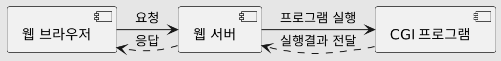
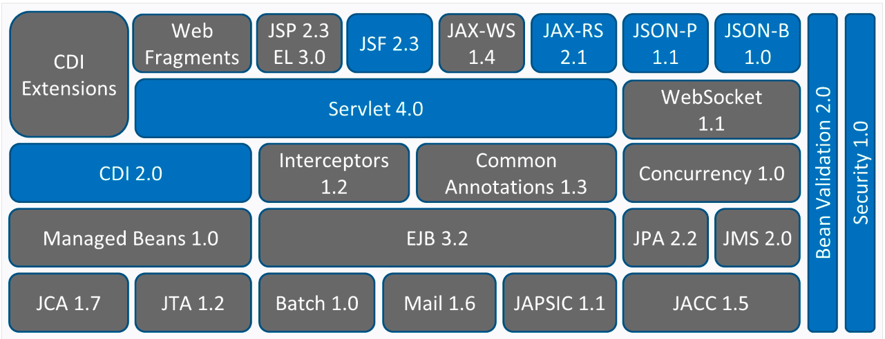

== Client - Server Architecture

==== Server
* Server Client 요청한 서비스 제공

==== Client
* Client는 서비스를 사용하는 사용자 혹은 사용자의 단말기

==== Server - Client
* 메일 서버
* 파일 서버
* 웹서버

=== Web Application Architecture
* 애플리케이션 구성 요소, 미들웨어 시스템, 사용자 인터페이스 및 데이터베이스 간의 상호 작용을 표시하는 "골격" 또는 레이아웃 의미, 이러한 작용을 통해 여러 응용 프로그램이 동시 작동 가능

==== Client - Server

|===
| |Client - Server Application |Web Application

|아키텍쳐 |**2 tire** |**multi tire**
|상호작용 |사용자의 인터페이스 또는 애플리케이션 |웹 브라우저
|실행 |애플리케이션 사전 설치 |웹 브라우저에서 직접 실행
|쿠키 |none |required
|보안 |상대적으로 사용자가 적기 때문에 위험이 적습니다. |사용자 수가 많을수록 상대적으로 높은 위험
|접근 |제한적 |anywhare
|===

== Web Server
* 브라우저와 같은 클라이언트로부터 HTTP 요청을 받아들이고, HTML 문서와 같은 웹 페이즈를 반환하는 컴퓨터 프로그램

== CGI
* Common Gateway Interface
* 웹 서버가 외부 프로그램을 실행할 수 있도록 해주는 인터페이스

=== CGI프로그램
* 컴파일 방식
** 기계어, 컴파일된 상태
** c++, c
* 인터프리터 방식
** 스크립트 언어
** Asp, Php, Python, Per
** 스크립트 엔진
*** 해당 스크립트를 실행할 수 있는 엔진
** 즉시 코드를 수정할 수 있음

=== JAVA EE
* JAVA 언어 플랫폼 중의 하나
* 대용량 멀티 티어의 엔터프라이즈 애플리케이션을 실행하고 운영할 수 있는 기술과 환경을 제공
* 특정 운영체제와 미들웨어에 종속되지 않고 정보 교환 및 애플리케이션 호환이 가능한 플랫폼을 제공하는 것이 목적

== Web.xml 파일 사용법(하위 태그들)
==== *Servlet: Servlet 등록 정보*

* servlet-name: Servlet 이름
* servlet-class: Servlet class의 FQCN
* init-param: Servlet의 초기 파라미터
* param-name
* param-value
* load-on-startup: 웹 애플리케이션 구동 시 로딩 여부

==== *servlet-mapping : Servlet과 URL 맵핑 정보*

* servlet-name
* url-pattern: 와일드카드 * 사용 가능, *. 는 확장자로 매칭
* /foo/bar/*
* *.jsp

==== *context-param : ServletContext의 초기 파라미터*

* param-name
* param-value

==== *welcome-file-list : welcome file 리스트*

* welcome-file : index.html 같은 파일… -&gt; 기본페이지

==== *error-page*

* 둘 중 하나 선택
* error-code : 404, 500 같은 http status code
* exception-type: Java 예외 class FQCN
* location: 예외 처리할 UR, /로 시작해야 함

==== *filter : Servlet Filter 등록 정보*

==== *filter-mapping : Servlet Filter와 URL 맵핑 정보*

==== *listener : Listener 등록 정보*

=== Cookie
* 사용자가 엡사이트를 방문할 때 해당 웹사이트의 웹서버에 의해 생성되어 사용자의 브라우저에 저장되는 작은 데이터 블록

=== Optional.of vs Optional.ofNullable
* Optional.of Null인 아닌 경우
** Null 인 경우 NULL point Exception 발생
* Optional.Nullable은 전달되는 인자값이 Null일 가능성이 있을때 사용

=== Map vs flatMap 차이
* map은 각각 단일 Stream
* flatMap은 하나의 Stream

=== Session
* 상태가 없는 (stateless) http 프로토콜 상에서 일정 시간동안 같은 사용자로부터 여러 요청을 하나의 상태로 유지시키는 기술

== 2장
=== RequestDispatcher
* 현재의 요청에 대한 정보를 저장했다가
* 다른 자원(Servlet, JSP, HTML)으로 전달(forward, include)하는 기능을 제공
* 두 가지 메서드 제공 forward(), include()
